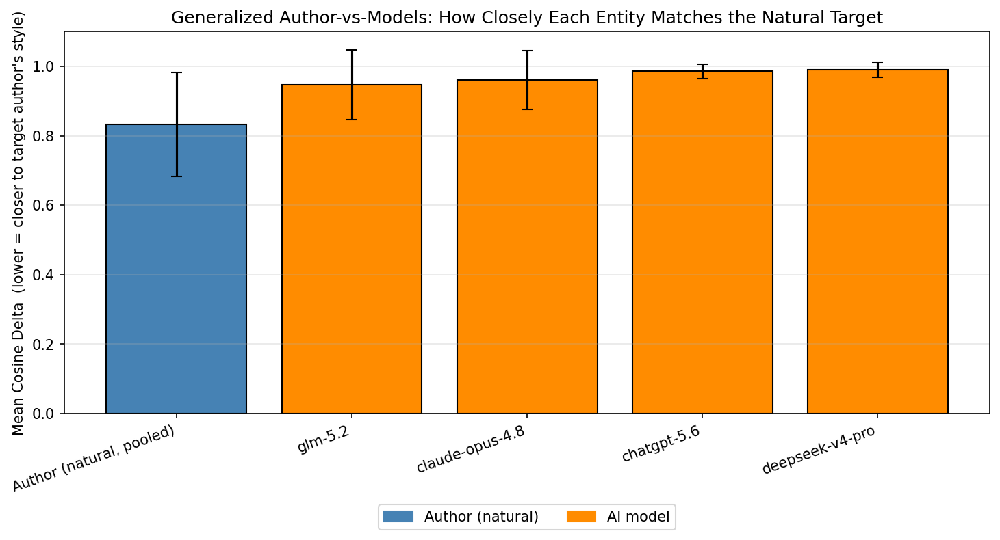
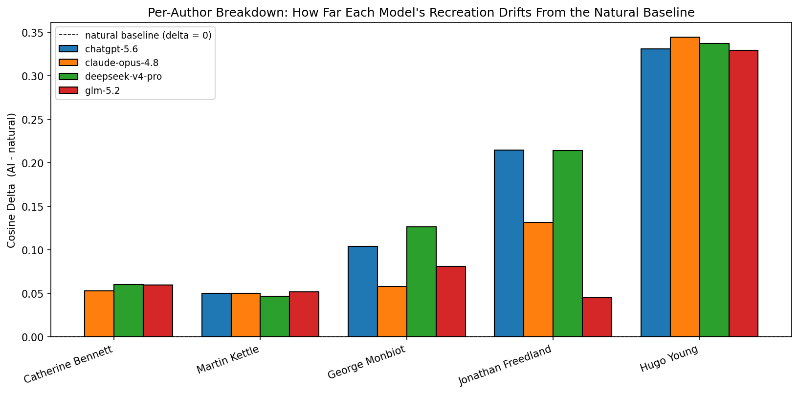
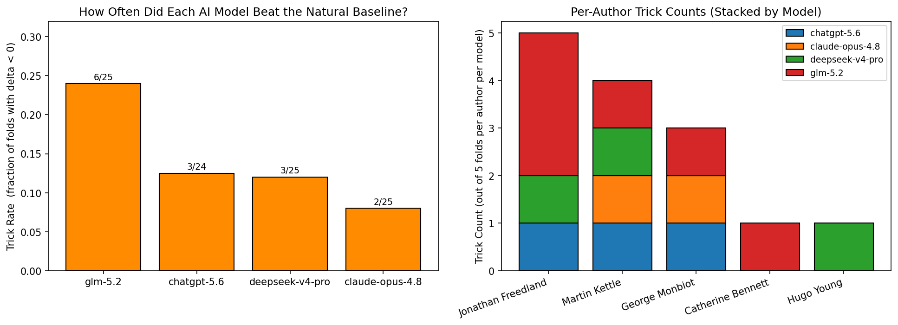
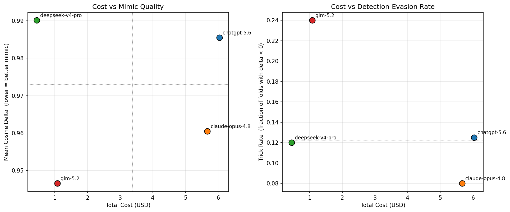
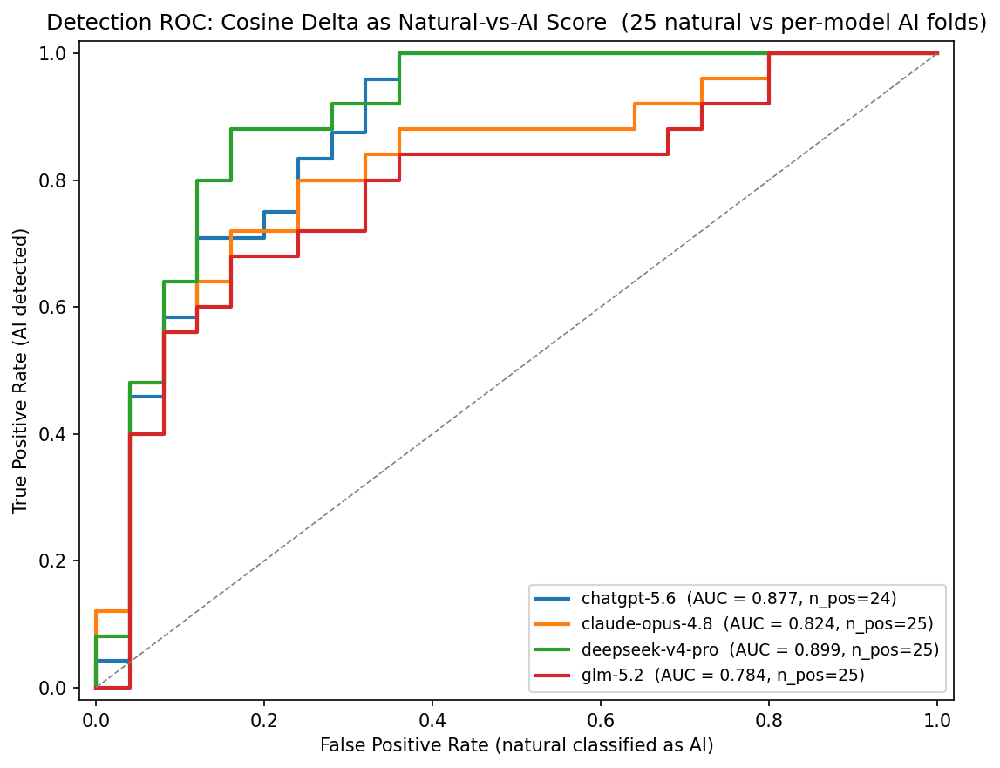
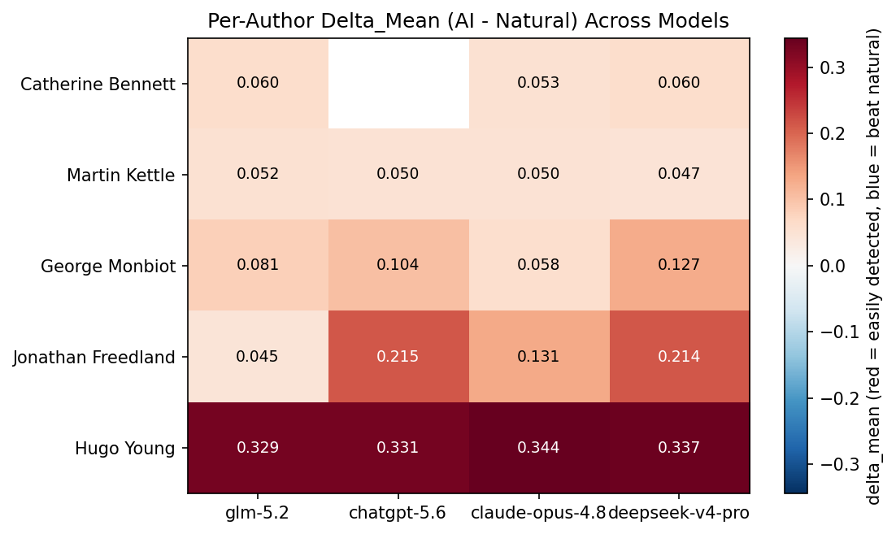
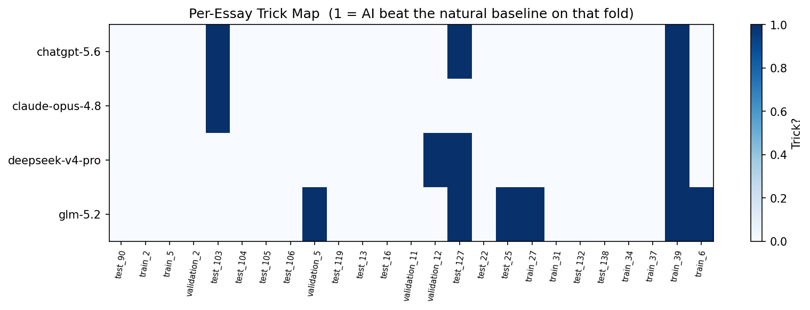
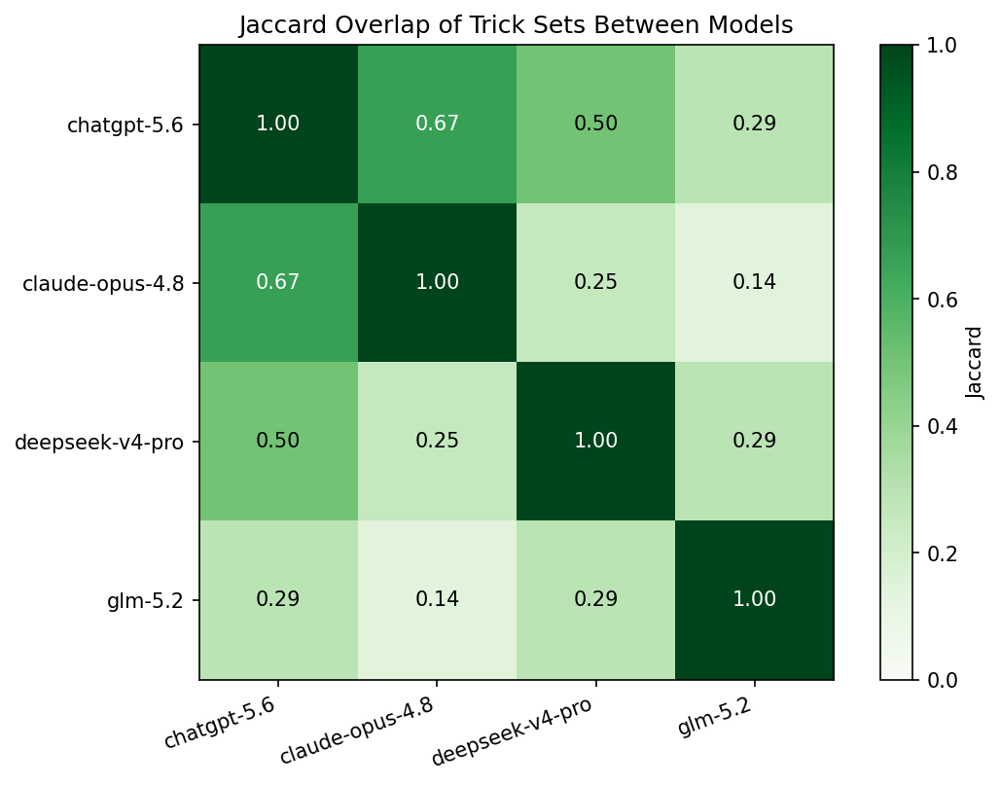
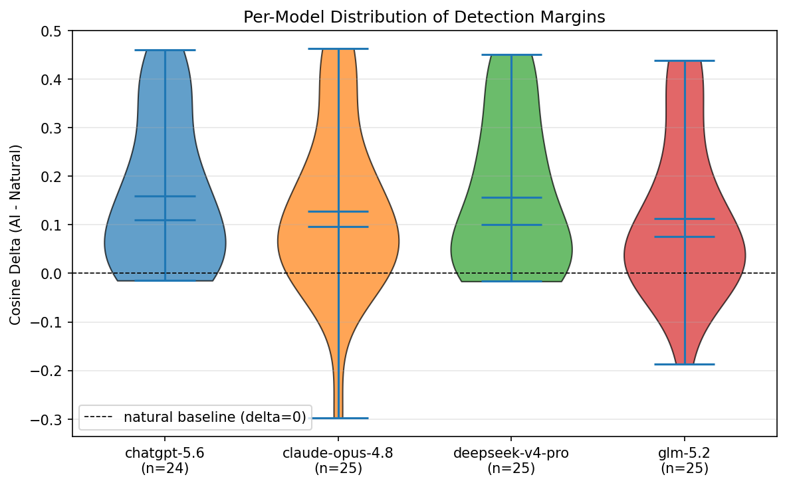

# Final Analysis - Stylometry vs AI Generation

This report consolidates the four-model OpenRouter cross-validation
(`chatgpt-5.6`, `claude-opus-4.8`, `deepseek-v4-pro`, `glm-5.2`).

## Headline numbers

- **Cheapest model (amortized total):** `deepseek-v4-pro` at
  **$0.45** for the 25-fold recreation run.
- **Closest mimic of natural style (lowest mean Cosine Delta):**
  `glm-5.2` at 0.947.
- **Easiest target author to impersonate (most tricks across all models):**
  `Jonathan Freedland` with a trick rate of
  25.0% (5/20).
- **Hardest target author to impersonate (fewest tricks):**
  `Hugo Young` with a trick rate of
  5.0% (1/20).
- **Detection AUC champion:** `deepseek-v4-pro` at 0.899
  (higher = stylometry detected the AI essay more reliably from its
  Cosine Delta score alone).

## Cost assumptions

Pricing for input/output USD per 1M tokens, with thinking treated as negligible per user instruction.

| Model | Input \$/1M | Output \$/1M |
|---|---|---|
| `claude-opus-4.8` | 5.000 | 25.000 |
| `chatgpt-5.6` | 5.000 | 30.000 |
| `deepseek-v4-pro` | 0.435 | 0.870 |
| `glm-5.2` | 0.930 | 3.000 |

Token counts are reconstructed from the exact prompts shipped to the
OpenRouter SDK (mirroring `src/generate.py`), since the recreation JSON
did not persist the provider usage payload. Token counts use
`cl100k_base` tiktoken when available; otherwise an NLTK
word-tokenizer with a 1.33 tokens/word fallback.

The details-stage (writing assignments) is paid once and reused by all
four re-creation models. Its cost is attributed to `glm-5.2` (the model
that actually generated the assignments) and amortized
(divide by 4) for the comparison table below.

| Model | Re-create input | Re-create output | Details overhead | Recreate \$ | Total \$ |
|---|---|---|---|---|---|
| `chatgpt-5.6` | 923,965 | 40,455 | ~0.20 | 5.83 | **6.04** |
| `claude-opus-4.8` | 923,965 | 34,788 | ~0.18 | 5.49 | **5.67** |
| `deepseek-v4-pro` | 923,965 | 42,362 | ~0.01 | 0.44 | **0.45** |
| `glm-5.2` | 923,965 | 39,764 | ~0.02 | 0.98 | **1.08** |

## Trick analysis (delta < 0)

AI "tricks" the stylometry model when the recreated essay's mean
Cosine Delta to the four-essay same-author corpus is *lower* than the
natural target's own distance - i.e., the detector would classify the
AI essay as the target author before the real one. Numbers are based
on the kept folds (chatgpt-5.6 fold 3 dropped, see Caveats).

| Model | n_folds | trick count | trick rate | mean delta | median delta |
|---|---|---|---|---|---|
| `chatgpt-5.6` | 24 | 3 | 0.125 | 0.159 | 0.110 |
| `claude-opus-4.8` | 25 | 2 | 0.080 | 0.127 | 0.096 |
| `deepseek-v4-pro` | 25 | 3 | 0.120 | 0.157 | 0.100 |
| `glm-5.2` | 25 | 6 | 0.240 | 0.113 | 0.076 |
| **ALL_MODELS_POOLED** | 99 | 14 | 0.141 | 0.139 | 0.096 |

Authors ranked by trick rate (across all four models):

| Author | Tricks | Folds | Rate |
|---|---|---|---|
| `Jonathan Freedland` | 5 | 20 | 25.0% |
| `Martin Kettle` | 4 | 20 | 20.0% |
| `George Monbiot` | 3 | 20 | 15.0% |
| `Catherine Bennett` | 1 | 19 | 5.3% |
| `Hugo Young` | 1 | 20 | 5.0% |

## Detection ROC

Stylometry scores each fold by Cosine Delta; we treat "AI >= threshold"
as the prediction and compute ROC against the 25 natural folds as
negatives.

| Model | AUC | AI folds (positive class) | Natural folds (negative class) |
|---|---|---|---|
| `chatgpt-5.6` | 0.877 | 24 | 25 |
| `claude-opus-4.8` | 0.824 | 25 | 25 |
| `deepseek-v4-pro` | 0.899 | 25 | 25 |
| `glm-5.2` | 0.784 | 25 | 25 |

## Plots

- 
- 
- 
- 
- 
- 
- 
- 
- 

## Caveats

- `chatgpt-5.6`: dropped 1 fold(s) from aggregates because the model returned an essay too short to chunk (minimum fill ratio on 1000-token chunks):
    - fold 3 - Catherine Bennett - `cross_topic_1/train/0/train_6`

## Methodology notes

- **Effect-size distance, not p-values:** the metric is Cosine Delta on
  the 500 most-frequent-word z-scored reference, per the project
  pipeline. Lower = closer in style.
- **Leakage-safe scoring:** per fold, MFW vocabulary and reference
  z-scores are fit on natural chunks only; AI chunks never participate
  in fitting.
- **Same-author corpus of 4 essays:** every fold leaves one
  target essay out and feeds the recreation prompt with the other
  four per-author essays. (In the actual generation call, the corpus
  is the full set of other essays by that author in `essays.json` -
  hence the larger recreation input token counts.)
- **Chunking policy:** 1000-token chunks at 0.8 fill-ratio. Any AI
  recreation shorter than 800 tokens after word tokenisation yields
  zero chunks for that fold and is dropped.
